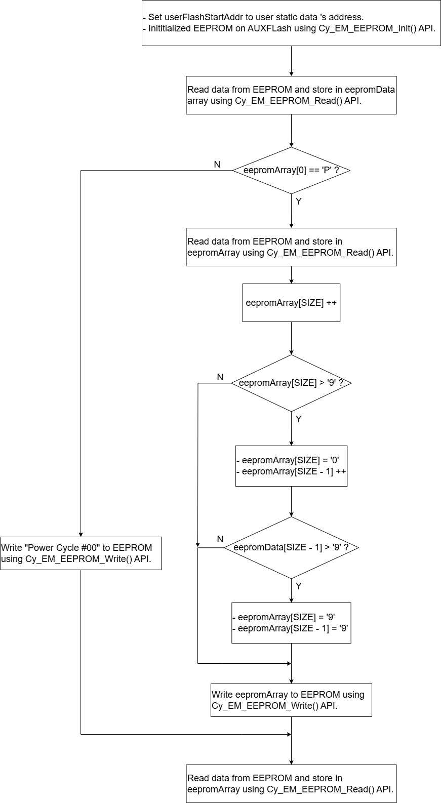
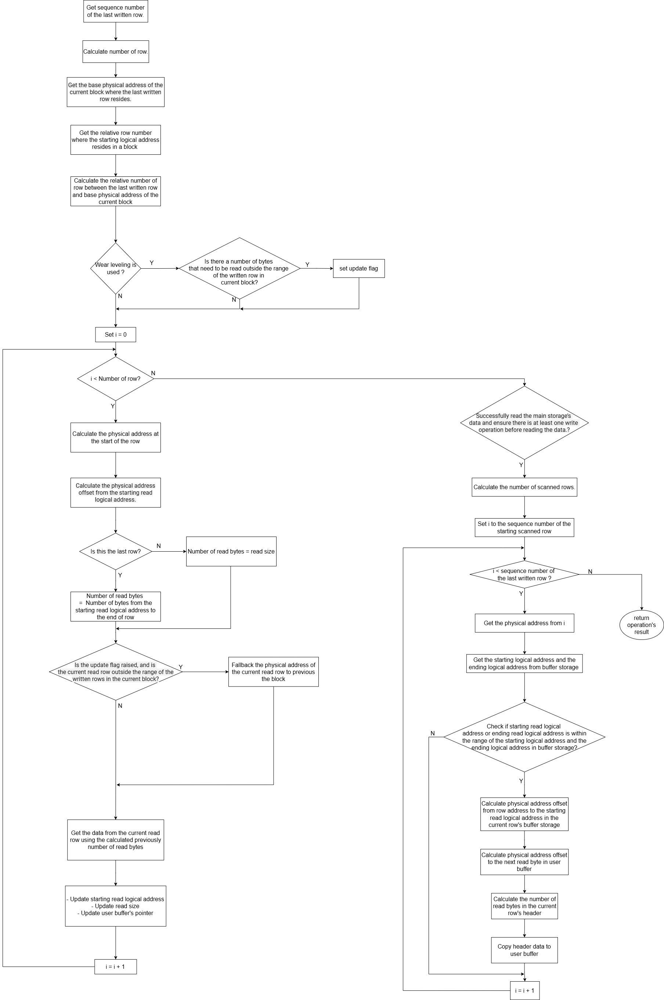
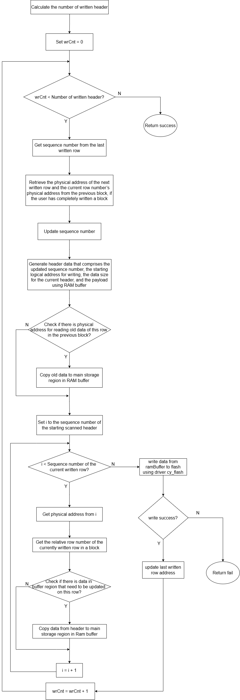

# Internal Flash Structure and Emulated EEPROM Example on PSOC 63 MCU

## I. Flash's Structure of PSOC 63 MCU

### Structure:
- PSOC 63 MCU implement dual core architecture with both core have shared access to memory. The MCU will access to flash memory through the code region in the address map.
- Flash memory is divided into 3 main regions which include Supervisory Flash (SFlash), Auxiliary Flash (AUXFlash), Application Flash. Each region is used for specific purpose:
    + Application Flash stores code images and constant data. Therefore, this region have the largest space compare to the rest . User have read and program/erase access to this region but due to Erase Disturb mechanism, it is recommended to store frequently-updated data on another region.
    + Auxiliary Flash provides more storing space when Application Flash's space is not enough. This region is typically used for EEPROM emulation which is benefit for storing log data updated on daily basis.
    + Supervisory Flash is reserved for system use. It contain trim parameter, system configuration parameter, protection and security settings, boot code and other Infineon proprietary information. User can read data from this region but program or erase access is limited.
- A region comprised of sectors and each sector is subdivided into rows. Row's size is 512 bytes. The distribution of rows and sectors is illustrated with the following diagram:
    + SFlash and AUXFlash have 2 sectors with each sector consist of 64 rows. The size of a sector in SFLASH and AUXFlash annotated in parentheses is 32kB.
    + Application Flash have 4 sectors with each sector consist of 512 rows. The size of a sector in Application FLash is 256kB.

- The following table list the address range of each region in CPU's address map:

| Address range | Region | Size |
| ------- | ----- | ----- |
| 0x1000 0000 - 0x100F FFFF | Application Flash | 1MB|
| 0x1400 0000 - 0x1400 7FFF | Auxiliary Flash | 32KB |
| 0x1600 0000 - 0x1600 7FFF | Supervisory Flash | 32KB |

- The read and program/erase access to flash memory are implemented as system call with IPC message communication mechanism. System call is a type of NMI exception's trigger to Cortex M0+. All system call will be serviced by Cortex M0+. Other processor(s) will add the function opcode and argument, which is the pointer to the data structure in SRAM, for the desired flash memory access to dedicated IPC mailbox, then trigger dedicated notify event. After detecting the trigger, Cortex M0+  will branch to NMI exception handler inside SROM from the initialized address in vector table. From there, the flash management API programmed by Infineon will execute flash operation corresponding to the opcode in IPC mailbox. The operation's result is returned in driver context together with a release event generated by Cortex M0+.

## II. Emulated EEPROM Example:
- The example demonstrates the process using EEPROM component and EEPROM Middleware API to initialize, read(write) data from(to) a EEPROM storage on Auxiliary Flash memory.
- The list of component's parameter:

| Parameter | Parameter's definition | Parameter's configured value in example |
| ---- | ----- | :----: | 
| EEPROM size | The number of bytes that user want to store in EEPROM. User must round up this value, which need to divide evenly to page's size. With PSOC 63 MCU, a page's size is 256 bytes. |  256 |
| Actual EEPROM size | The actual size that will be allocated in Flash Memory to EEPROM. This value, which has already taken in account of Wear Level Factor and Redundant Copy, is calculated as followed formula: Actual size = EEPROM size * 2 * Wear Leveling * (Redundant Copy + 1). This value will be calculated automatically, user will not set this parameter. | 2048 |
| Redundant Copy | When this parameter is enabled, checksum value is calculated for each row of EEPROM and store on that row. A copy of the EEPROM content will be stored at another location. This copy will be used to restore EEPROM data in case the read data have error checksum value. | Yes |
| Use Blocking Write | User can choose between Blocking mode or Non-blocking mode for Write Operation to EEPROM. Non-blocking mode will not block interrupt in case a write operation is executing. | No |
| Use Emulated EEPROM | User can choose storage location for EEPROM in Application Flash or in Auxiliary Flash. When this parameter is enabled, EEPROM will be placed in Auxiliary Flash, otherwise user have to statically allocate memory for EEPROM in software. | Yes |
| Wear Level Factor |  Wear leveling is a technique that ensure every location in memory get roughly equal level of being erased/programmed to prevent 1 location in the memory from wearing out prematurely. Wear level factor (in my understanding) represent the number of memory cell used to store 1 data element getting updated frequently. For example, if wear factor equate 2, a memory cell A store data element A, when this data element need to be updated to data element B, instead of erasing memory cell A, data element B will be programmed to memory cell B. Therefore, there exist 2 memory cell store 2 version of 1 data element. The higher the wear factor is , the more flash need to be used, but a higher number of erase/write cycles can be done on the EEPROM. | x2 |

- List of used EEPROM API in example code :
  
| API prototype | Understanding |
| ---- | ---- |
| cy_en_em_eeprom_status_t Cy_Em_EEPROM_Init(cy_stc_eeprom_config_t* config, cy_stc_eeprom_context_t * context) | This function will initialize EEPROM on flash memory base on config struct parameter. If user enable option Use Emulated EEPROM on the configuration box of EEPROM component, the config and context struct will be defined in Em_EEPROM.c file and used as global variable. User need to set userFlashStartAddr variable in config struct before passing this struct as argument to init function. The return value is the result of the operation being success or fail. |
| cy_en_em_eeprom_status_t Cy_Em_EEPROM_Read(uint32_t addr, void * eepromData, uint32_t size, cy_stc_eeprom_context_t * context); | This function will read an array of data from EEPROM starting from the logical address in addr parameter with the array's size indicated by size parameter, then store this data to user array pointed to by eepromData parameter. The return value is the result of the operation being success or fail. |
| cy_en_em_eeprom_status_t Cy_Em_EEPROM_Write(uint32_t addr, void * eepromData, uint32_t size, cy_stc_eeprom_context_t * context); | This function will write a user data pointed to by eepromData parameter to EEPROM starting from the logical address in addr parameter and the data's size is indicated by size parameter. The return value is the result of the operation being success or fail. | 

- Example code execute mainly on Cortex M4 core follow the below flow chart:

- The data format stored in EEPROM:

    + User’s data stored in EEPROM is divided into blocks, each of which is equal to the configured size of the EEPROM component in the schematic design. The number of used blocks is equal to user's desired EEPROM size multiplied by wear-leveling factor.
    + A block consists of rows, each with 512 bytes in size. In a row, the most significant 256 bytes serve as the main storage, while the remaining bytes are used as EEPROM header data, functioning as a buffer.

|  Data fields | Storage Data | CRC | Buffer Data | Size of buffer data | Starting Logical address | Sequence Number |
| :----: | :----: | :----: | :----: | :----: | :----: | :----: |
| **Length of data field** | 256 high bytes | 4 bytes | 240 bytes | 4 bytes | 4 bytes | 4 bytes |

- Flow chart for Cy_Em_EEPROM_Read:

- Flow chart for Cy_Em_EEPROM_Write:

